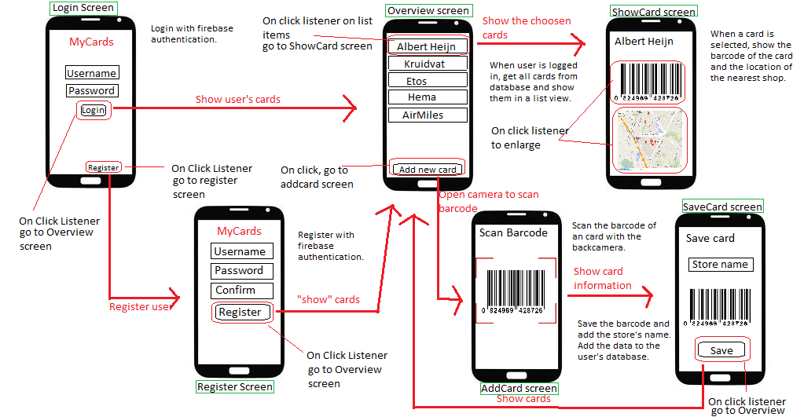
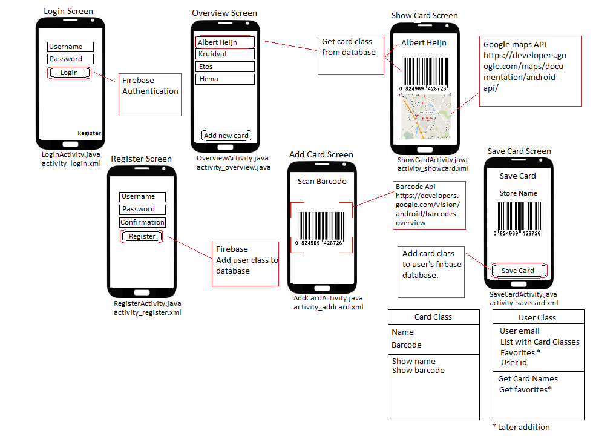

# myCardsApp
Susanne Binkhorst

## Advanced scetch

## Diagram Utility Modules and Classes

## Functions

Login Screen:
* LogIn()
* LogOut()
* goToRegister() (onClick)

Register Screen:
* Register() (onClick)
* addUserToDatabase()

Overview Screen:
* logOut()
* goToCard() (onClick Listview)
* goToAddCard() (onClick)
* enlarge() (onClick)

Add Card Screen:
* scanCard()

Save Card Screen:
* getBarcodeInfo()
* addCardToDatabase() (onClick)

Show Card Screen:
* getCardFromDatabase()
* getLocation()

## API, Framewroks and Plugins

* API for location user and location store: https://developers.google.com/maps/documentation/android-api/
* External Components: firebase
* API for barcode: https://developers.google.com/vision/android/barcodes-overview
