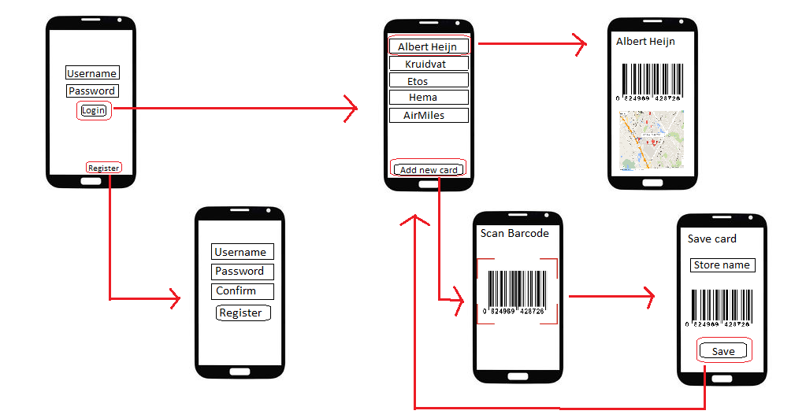

# myCardsApp
Susanne Binkhorst

## Problem statement
These days every store has some kind of customer of privilage card. When you have a card of each of these stores your wallet will get to 
full and it can be hard to find the correct card at the cassiere. With my app, this problem will be solved. You can scan and save each card
on your app. Now you can find the card of the store more easily and it saves a lot of space in your wallet. Find the nearest store of your
privilage card to shop. 

## Solution
### Summary
Save all your customer and privilage cards in one app.

### Visual Sketch

### Main features
* **Register**
* **Login**
* **Add cards**
* **See saved cards and show barcode**
* **Show nearest store**
