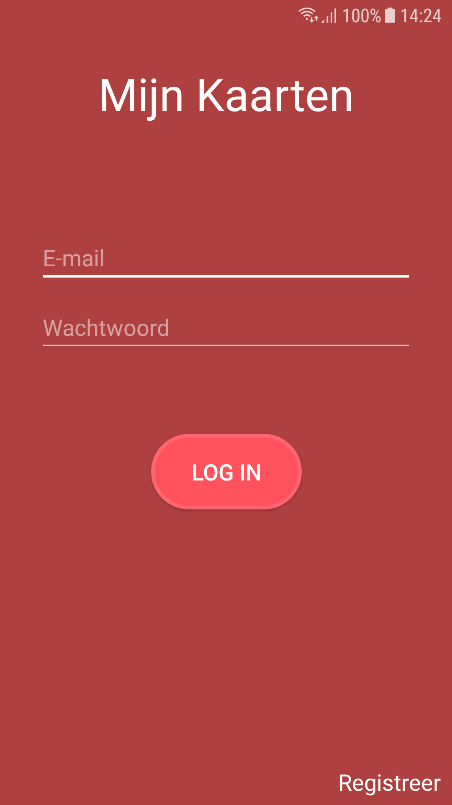
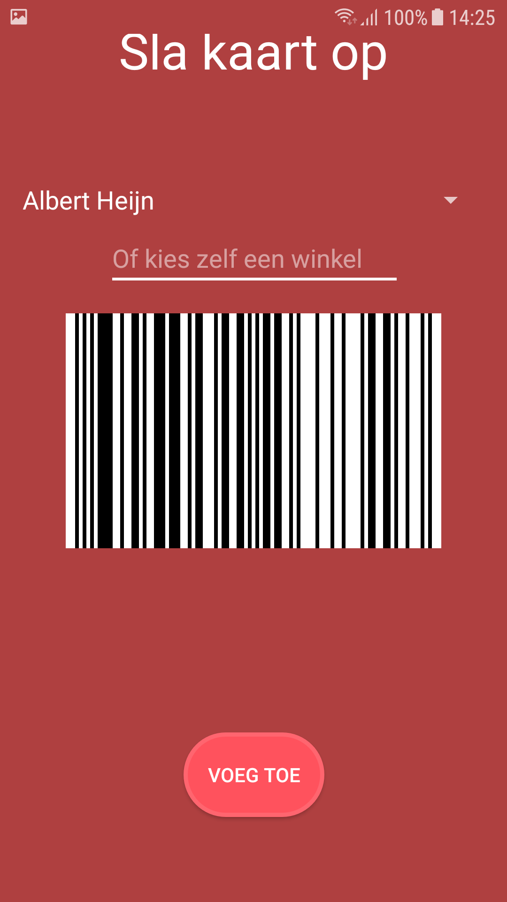
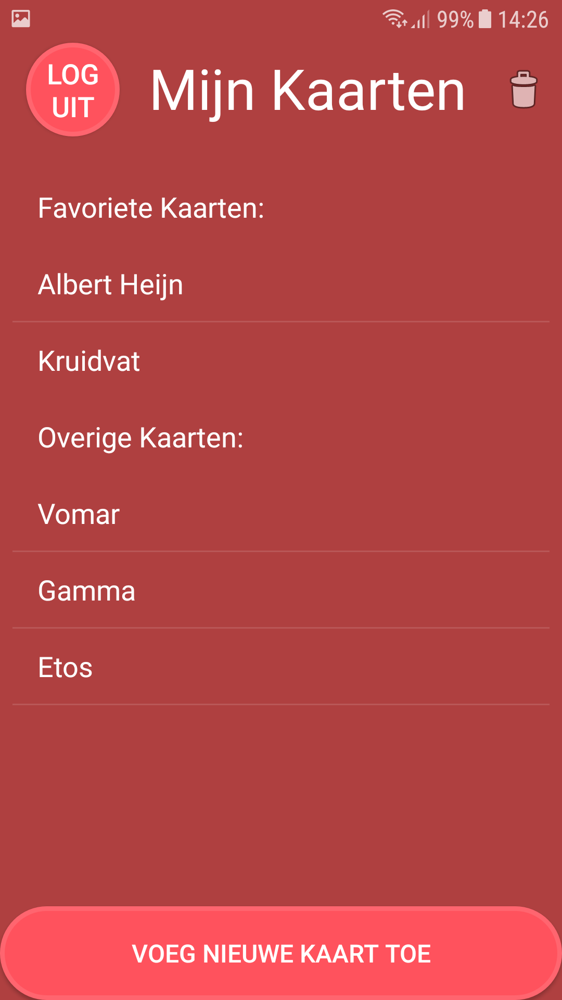
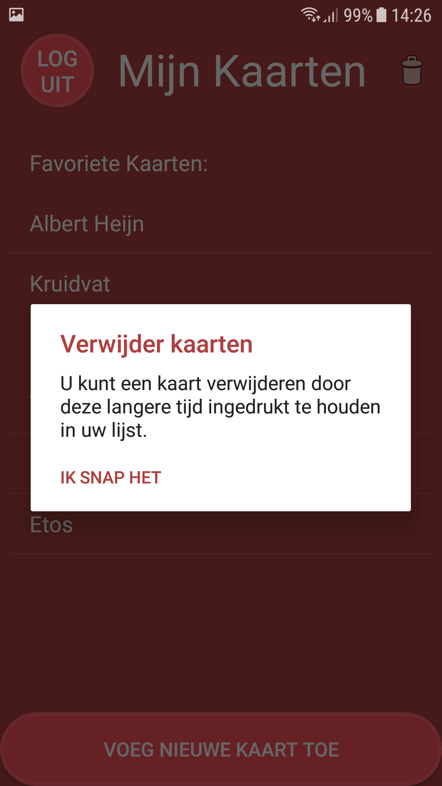
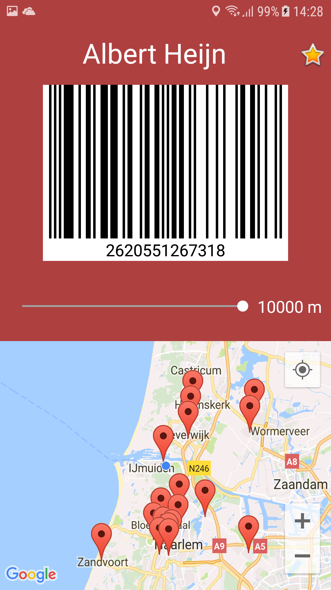

# CardWallet
Susanne Binkhorst

## Purpose
These days every store has some kind of customer of privilage card. When you have a card of each of these stores your wallet will get to 
full and it can be hard to find the correct card at the cassiere. With my app, this problem will be solved. You can scan and save each 
card on your app. Now you can find the card of the store more easily and it saves a lot of space in your wallet. Find the nearest store of
your privilage card to shop. 

## Screenshots
  

## Demo
https://www.youtube.com/watch?v=yBVGJ7AXEuA

## External code
External codes are implemented in AddCardActivity, SaveCardActivity and ShowCardActivity.
* https://www.androidhive.info/2017/08/android-barcode-scanner-using-google-mobile-vision-building-movie-tickets-app/
* https://github.com/mitchtabian/Google-Maps-Google-Places/tree/ab0337bee4f658c8708bf89ef7672bdf5de8669a

## Libraries
* https://github.com/zxing/zxing
* https://developers.google.com/places/web-service/search

Copyright (c) 2018 Susanne Binkhorst 
