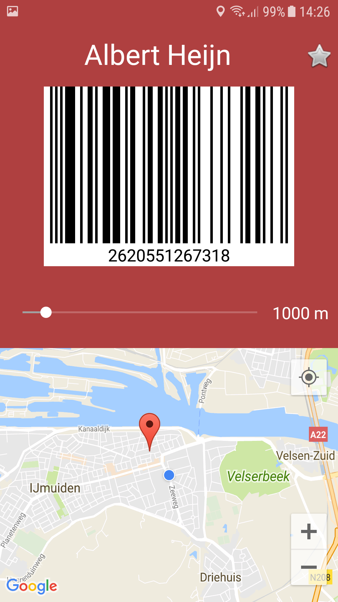

# CardWallet
## Short Discription
With this app, you will be able to store all your customer and privilage cards in one place. Just scan the barcode of your card and you
can easily access it via your phone. Find the nearest store for all your cards and add them to your favorites.

## Technical Design
### LoginActivity.java
The user will first start at Login Activity, in this activity the user can (obviously) sign in to their account to go to Overview Activity
or go to Register Activity to register. 

### RegisterActivity.java
At Register Activity, the user can create an account which will be verified through Firebase Authentication. Once a user is registered,
the user will be redirected to Overview Activity.

### OverviewActivity.java
Overview Activity gives an overview of the user's cards which will be loaded from the user's database. The user can select a card by 
tapping on the card name in the listview, the card will then be shown in ShowCard Activity. The user can delete a card by long clicking
the card name in the listview. The user can log out by clicking on the logout button, the user will be send to Login Activity. The user 
can add cards by clicking on the "Voeg nieuwe kaart toe" button, the user will be redirected to AddCard Activity.

### AddCardActivity.java
This is a simple activity where the camera of the phone is opened and the barcode can be scanned. If a barcode was scanned, the user
will be redirected to SaveCard Activity.

### SaveCardActivity.java
In this activity the user can see its scanned card barcode. The user can select the name of the store in a spinner or fill it in in a 
edit text. When a user chooses to fill the store name in, the user gets a warning. If the name is not correct or is perhaps from a local
store, there might be a chance that the store location can't be found on google maps and hence will not be shown on the map. The user
can then save the card and this card will be added to the user's database. The user will be redirected to Overview activity where its
new added card will be displayed with the previously added cards.

### ShowCardActivity.java
In this activity the selected store from the listview in Overview Activity will be shown. The user can see the store's name, the card
barcode, the barcode number and the nearest location of the store. The user can here set this card in the list with favorite cards or
delete the card from this list. The user can change the range of the nearest store in a seekbar, this range is set on 1000 meters by
default. The seekbar's range is between 0 and 10 km (10000 m). The user can also find the route to the nearest store and check if the
store is open now.

### User.java
Class for the user. An User class consists of only an arraylist. In this arraylist are the user's cards, which are also classes. The 
User class has the following methods:
 * getCardNames: make a array with all the user's cards.
 * getCardBarcode: get the barcode of a specific card.
 * addCard: add a card to the user's arraylist.
 * checkCard: check if a card was already added.
 * updateBarcode: update the barcode of a specific card.
 * deleteCard: delete a card from the arraylist.
 * getFavorites: get a list of all the user's favorite cards.
 * setFavorites: set a specific card as favorite or not favorite.
 
### Card.java
The Card class defines a specific card. The card class contains the store name, the barcode of the card and whether a card is the user's
favorite.The only method of this class is setFavorite, this will update the favorite boolean of the card.

## Process
The difficulties from this app where the barcode scanner and the google maps map. I had to to a lot of research on the internet before
I got something that I could use and that worked. 

### Automatic opening
I didn't implement the automatic opening of a card when in the store because of time problems, probable difficulties with shopping 
malls and the google maps API. The problems with the google maps API is that when you are in a store, and you try to find nearby places,
to store won't be found unless you give the exact name of the store instead of just the type store or point of interest. I didn't have
enough time to find another possible solution for this. Instead of this I implemented a favorites lists, so that the frequent used cards
are easy to find. If I would have been given more time, I would have liked to look into the possibilities of the google places API or
perhaps an other API.

### Barcode scanner
The difficulties with the barcode scanner were to open the camera, scan the barcode and reproduce the barcode as an image. At first I
didn't really know what barcodes were. The barcode is just the combinations of the numbers that are usually displayed under the barcode.
The opening of the camera and reading the barcode are done with a library from androidhive 1 and google vision. The
reconstruction of the barcode was done with the library zxing 2.

### Google maps
The difficulties with the map where displaying the map in a mapview/fragment in the activity, showing the user's location and get the
nearest of a selected store. To display the map and the current location I used some of the code of the github from mitchtabian 3 and some of my own thinking. To find the nearest location of a store I used the google places API for nearby search 
4.

## Demo
https://youtu.be/yBVGJ7AXEuA

## References
1. https://www.androidhive.info/2017/08/android-barcode-scanner-using-google-mobile-vision-building-movie-tickets-app/
2. https://github.com/zxing/zxing
3. https://github.com/mitchtabian/Google-Maps-Google-Places/tree/ab0337bee4f658c8708bf89ef7672bdf5de8669a
4. https://developers.google.com/places/web-service/search
